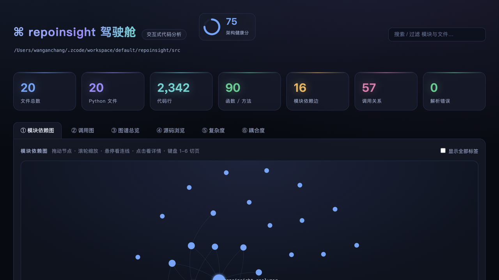
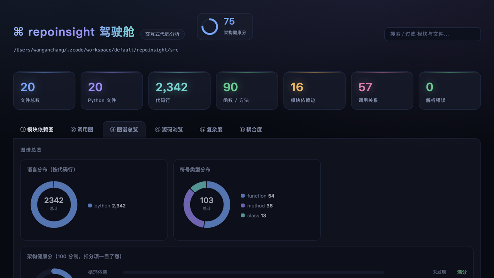
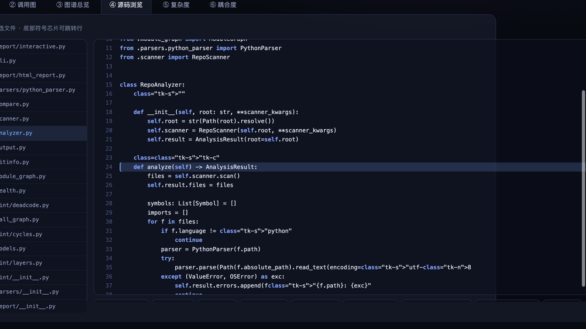

# repoinsight · 代码库静态分析工具

扫一遍代码仓库,告诉你三件事:**代码长什么样**(符号表)、**谁依赖谁**(模块依赖图)、**谁调用谁**(函数调用图),再附赠复杂度、耦合度、死代码、循环依赖、git 热点等体检报告。

- ✅ 零依赖:只用 Python 标准库(3.9+),`pip install` 秒装
- ✅ 单文件交互报告:HTML 双击就能开,不需要服务器、不需要联网
- ✅ 全中文界面
- ✅ 94 项单元测试,四版本 CI

## 效果预览

**模块依赖图**(可拖拽 / 缩放 / 点击看详情):



**架构健康分**(100 分制,扣在哪一目了然):



**源码浏览器**(语法高亮 + 符号跳转):



## 快速上手

```bash
# 方式一:直接用(不用安装)
PYTHONPATH=src python3 -m repoinsight.cli summary 你的项目/

# 方式二:安装成命令
pip install .
repoinsight summary 你的项目/
```

## 命令一览

| 命令 | 干什么 |
|---|---|
| `summary 项目/` | 文字摘要:文件数、代码行、复杂度排行、耦合排行 |
| `report 项目/ --interactive` | **交互式驾驶舱报告**(推荐):依赖图可拖拽缩放、源码浏览器、搜索 |
| `report 项目/` | 简版静态 HTML 报告 |
| `lint 项目/` | 体检:循环依赖、疑似死代码、未使用的导入、分层规则 |
| `who-calls 项目/ 函数名` | 查一个函数被谁调用、它调用谁 |
| `modules 项目/ -o modules.dot` | 模块依赖图(Graphviz DOT,可用 `dot -Tpng` 转图片) |
| `calls 项目/ -o calls.dot` | 函数调用图(DOT) |
| `hotspots 项目/` | 哪些文件改得最勤 × 最大(需要 git 仓库) |
| `score 项目/` | 架构健康分 0-100,附 5 个维度扣分明细 |
| `diff 项目/ HEAD~1 HEAD` | 对比两个版本:新增/删除的文件、函数、调用边,复杂度升降 |
| `json 项目/ -o out.json` | 完整分析结果导出 JSON |

交互报告长这样(暗色驾驶舱风格,全部离线可用):

- ① 模块依赖图:发光节点 + 点击看依赖详情 + 拖拽/缩放
- ② 调用图:点函数看谁调它、它调谁,点名字跳源码
- ③ 图谱总览:语言环形图、符号分布、文件热力格
- ④ 源码浏览:语法高亮 + 符号芯片跳行
- ⑤⑥ 复杂度 / 耦合度表格

## 分层规则检查(可选)

写一个 `rules.json`:

```json
{"forbidden_edges": [["ui.*", "core.internal.*"]]}
```

```bash
repoinsight lint 项目/ --rules rules.json
```

## 配置文件

在项目根目录放一个 `.repoinsight.json`(全部可选),所有命令自动读取:

```json
{
  "ignore": ["docs", "scratch"],            // 额外跳过的目录
  "forbidden_edges": [["ui.*", "core.*"]],  // 分层规则:禁止 ui 引 core
  "entrypoints": ["handle_*"],              // 死代码检查的豁免名单(框架回调等)
  "min_score": 70                           // 健康分门禁线
}
```

也可以用 `--config 路径` 指定其他配置文件。

## CI 门禁:不让架构变差

健康分低于门槛时 `score` 命令以失败退出,可以直接当 CI 卡点:

```bash
repoinsight score 项目/ --min 70     # 低于 70 分 → 退出码 1,CI 失败
```

或者直接用本仓库提供的 GitHub Action(任何仓库可用):

```yaml
- uses: 0718lol/repoinsight@main
  with:
    path: src
    args: --min 70
```

## 用它分析它自己

```bash
PYTHONPATH=src python3 -m repoinsight.cli report src --interactive -o 自检报告.html
open 自检报告.html
```

## 架构 & 二次开发

看 [ARCHITECTURE.md](ARCHITECTURE.md):数据流水线图、每个文件职责表、
「加一门语言 / 加一个度量 / 加一条 lint 规则 / 加一个图表 / 加一条命令」的逐步修改路径。

## 测试与发布

```bash
python3 -m pytest tests/ -q
```

发布到 PyPI:打 `v*` 标签推送即可,`.github/workflows/publish.yml` 会自动构建并上传
(首次使用需在 PyPI 上为本仓库配置 trusted publisher,或在仓库 Secrets 里配 `PYPI_API_TOKEN`)。

## License

MIT
